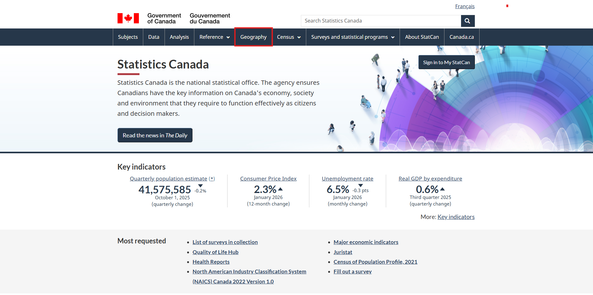
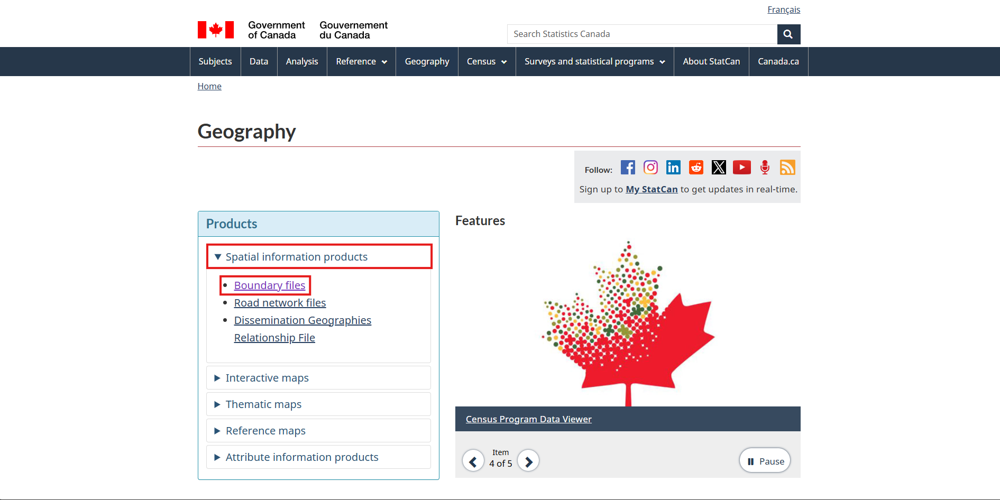
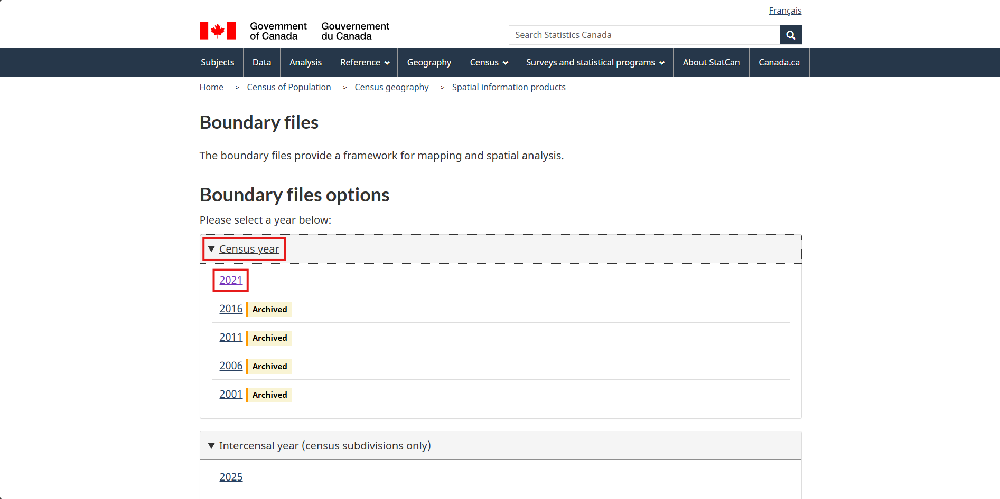
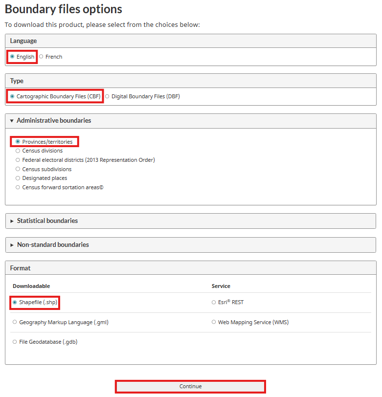

# Downloading a Boundary File

To get our boundary file we will use **Statistics Canada**. Use this link: [Statistics Canada](https://www.statcan.gc.ca/en/start)

1. Begin by clicking on the **Geography** tab.

2. Under **Spatial information products**, click on **Boundary Files**.

3. Under **Census Year**, click on **2021**.

4. To set up your download, select English, Shapefile (.shp), and Cartographic Boundary File under the Type dropdown menu. (Note: Cartographic Boundary Files (CBF) follow coastlines and include water bodies whereas Digital Boundary Files (DBF) are defined around major land masses). Make sure to select **Provinces/territories** under the **Administartive boundaries** menu. Once the required parameters are selected, click Continue.

5. Download the zip file from the link provided and save it to your project folder.
6. Geospatial data often comes in a zip file as it is made up of a collection of files. You will need to unzip it to use it in ArcGIS Pro. To unzip it, right click on the zip file and select **Extract all**.
