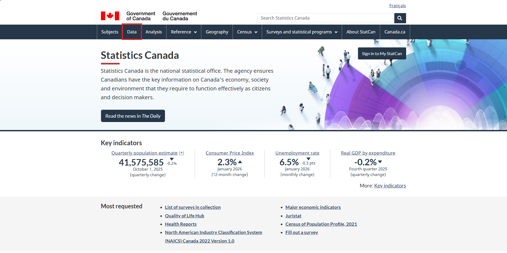
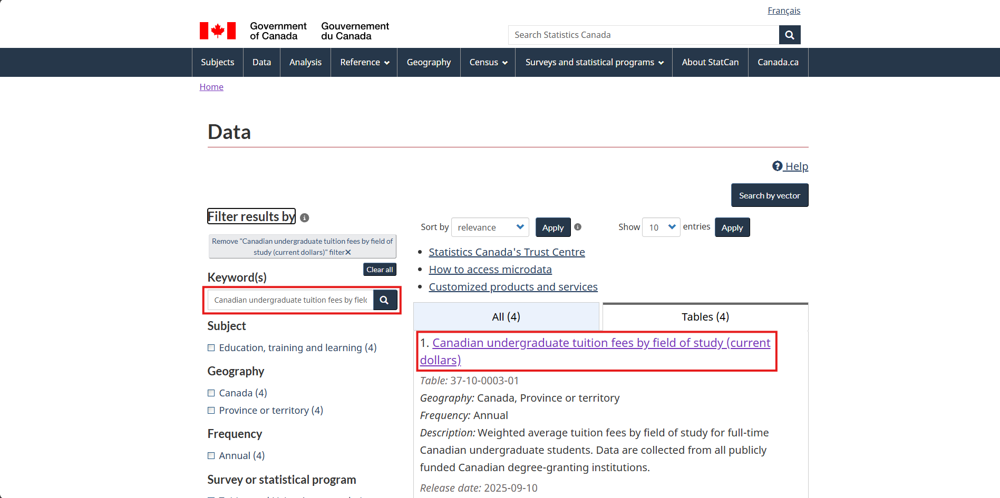
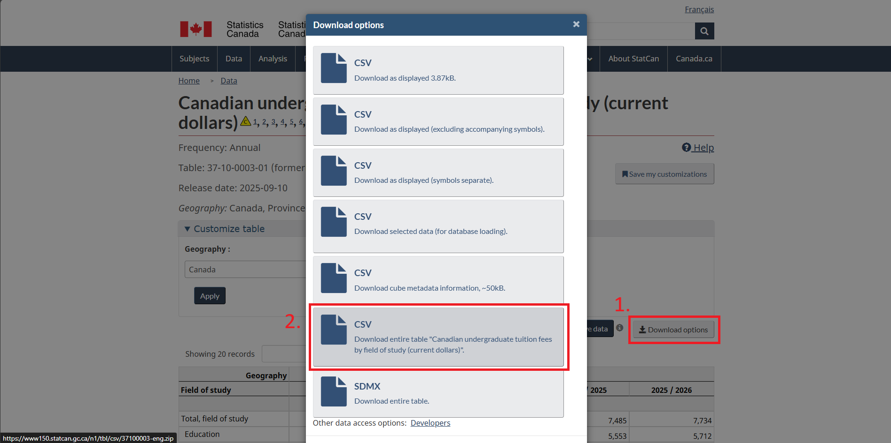

# Downloading Census Data

To get our census data file we will once again use **Statistics Canada**. Use this link: [Statistics Canada](https://www.statcan.gc.ca/en/start)

1. Begin by clicking on the **Data** tab.

Once you are here you can explore all the publicly available census data. For this workshop we will be using a dataset called *Canadian undergraduate tuition fees by field of study (current dollars)*. If you would like to follow along with this dataset, copy paste this search term into the **Keyword** search field, press enter, and click on the first option (or click this link: [Dataset](https://www150.statcan.gc.ca/t1/tbl1/en/tv.action?pid=3710000301)).

Feel free to explore the dataset here. Once you are ready, select **1. Download options**. This will prompt you with several download options. We will be selecting *2. Download entire table "Canadian undergraduate tuition fees by field of study (current dollars)".* This will be downloaded to your local machine.

This data also often comes in a zip file as it is made up of a collection of files. You will also need to unzip it to use it in ArcGIS Pro. To unzip it, right click on the zip file and select **Extract all**.

Now we can close our internet browser and open ArcGIS!
