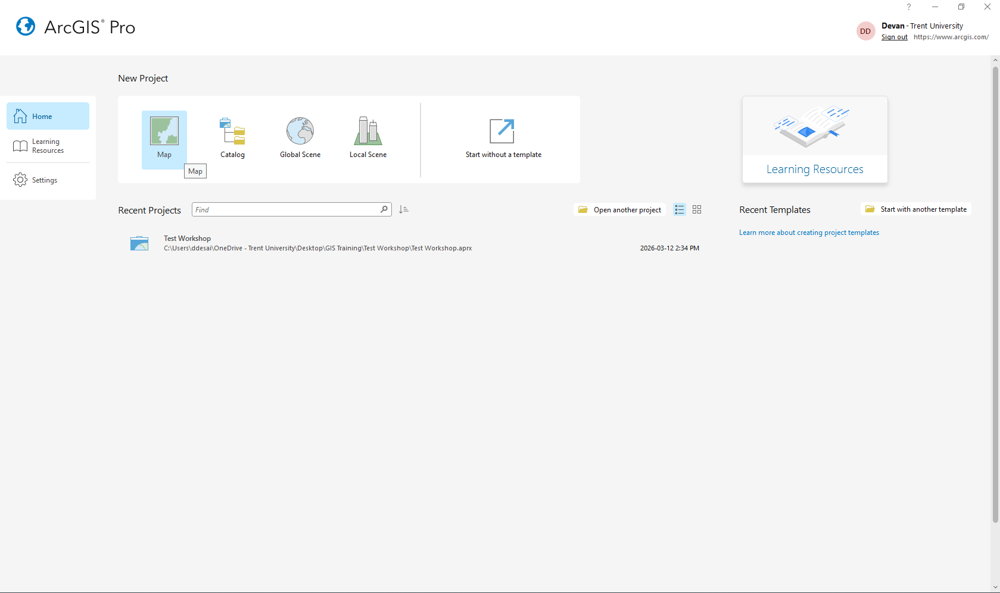
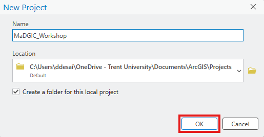
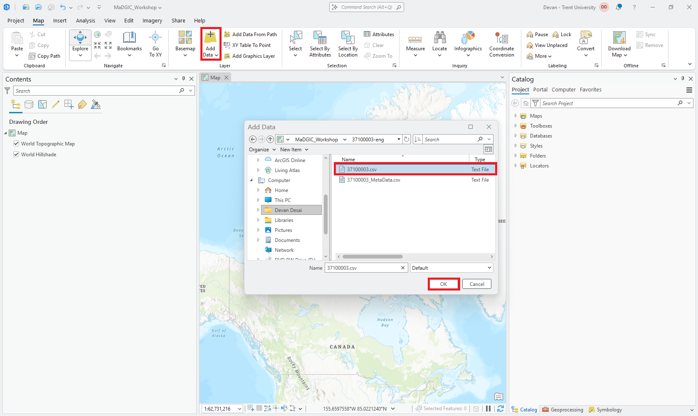
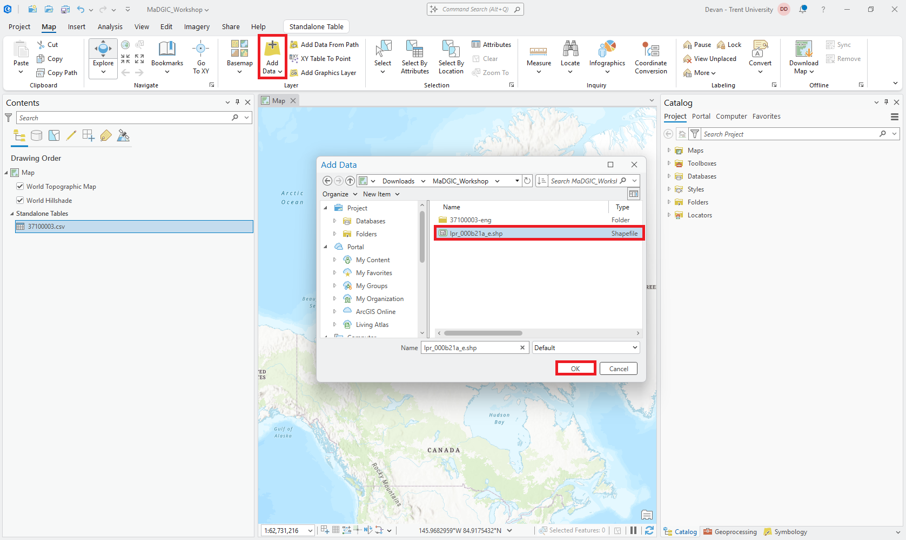
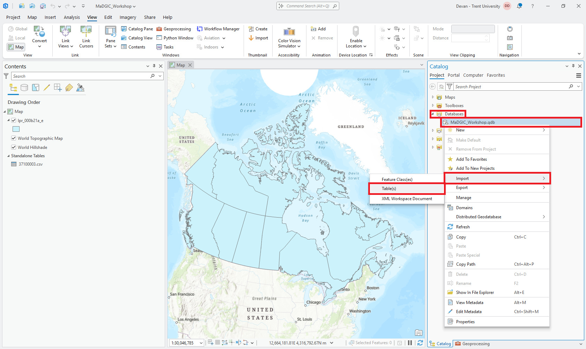
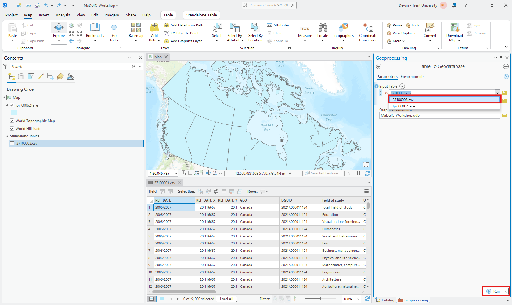
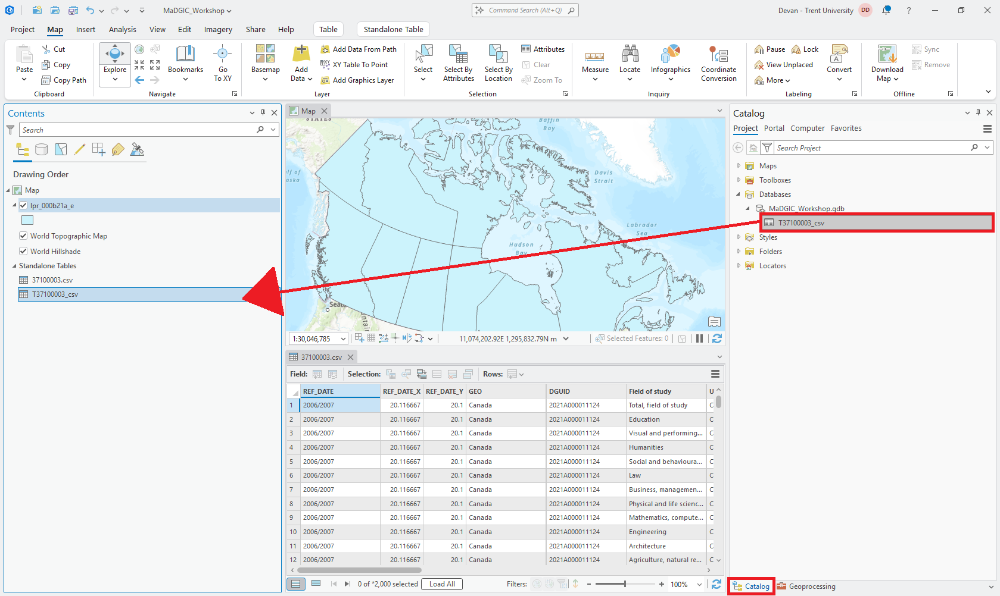
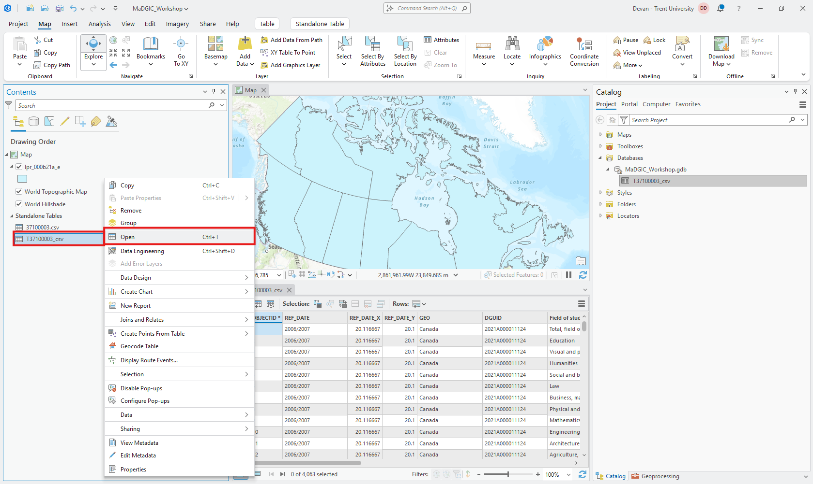
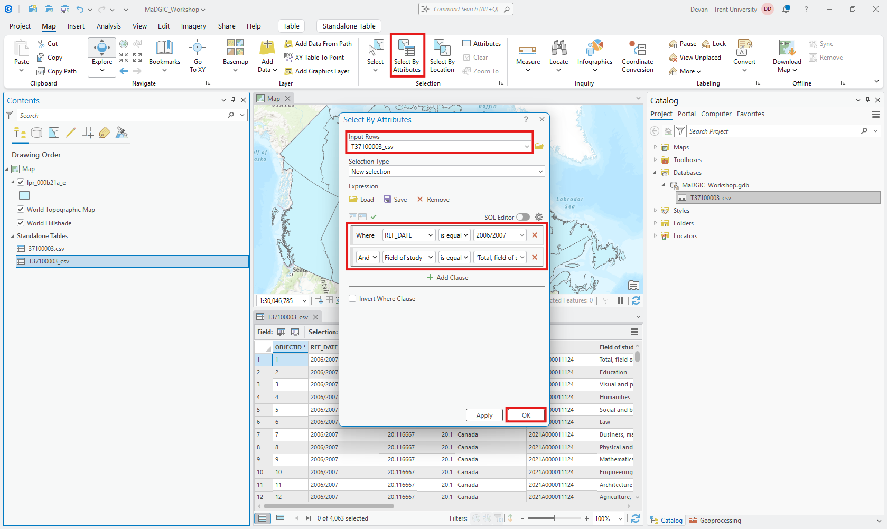
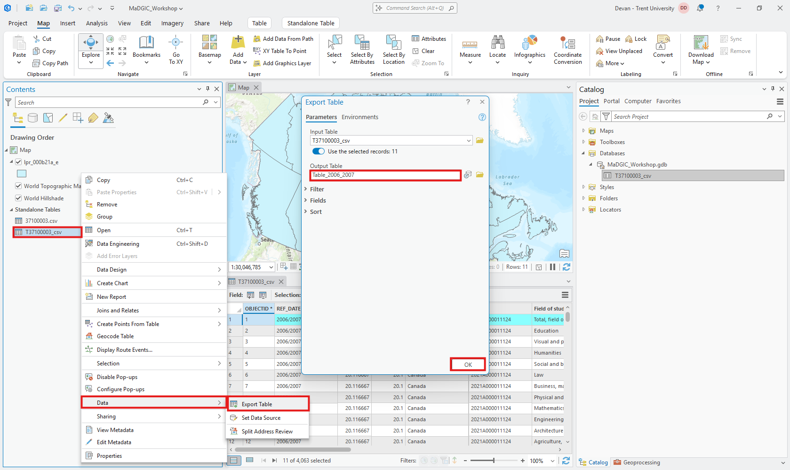

# Creating a Project

Beign by opening ArcGIS and clicking **Map**. Name it whatever you'd like and click **OK**

# Importing Data
The first thing we have to do is bring in our census data and our boundary file. Let's start with our census data. Click **Add Data** and navigate to your unzipped census data. Click the .csv file and click **OK**. Now our census data is in ArcGIS!

Let's do the same thing for the boundary file. Once again, click **Add Data** and navigate to your unzipped boundary data. This time, click the .shp file and click **OK**.

# Transforming Data
Now that our data is in, before we get to filter the points we want, we have to transform our data. To use one of the tools we need, our data requires OIDs (Object IDs). We can get these by transforming our data into a geodatabase. On the right side in the **Catalog** pane click the **Databases** drop down. Then *right-click* the 

