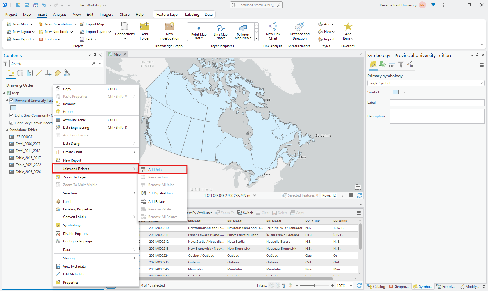
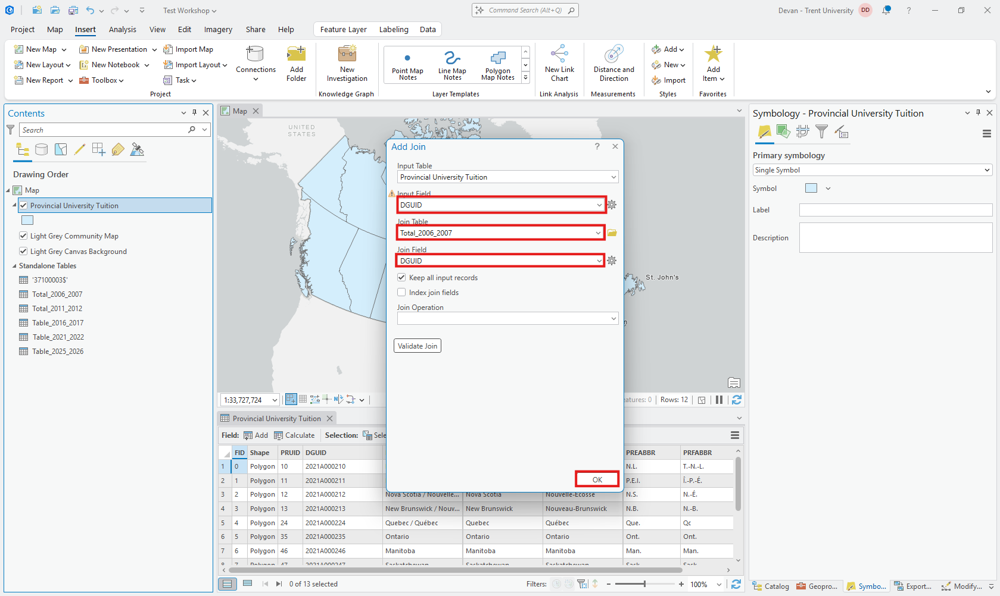
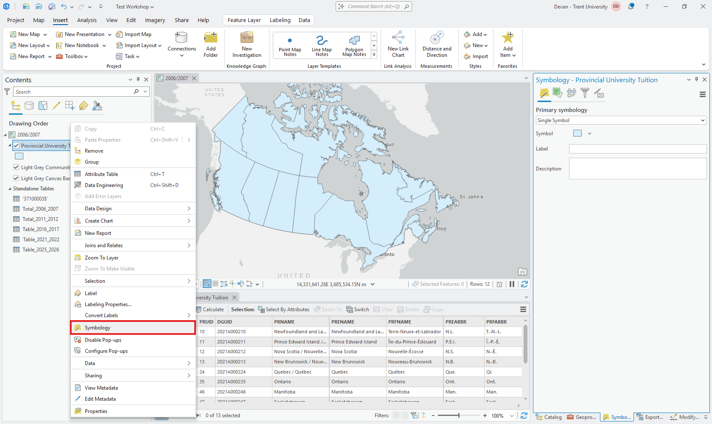
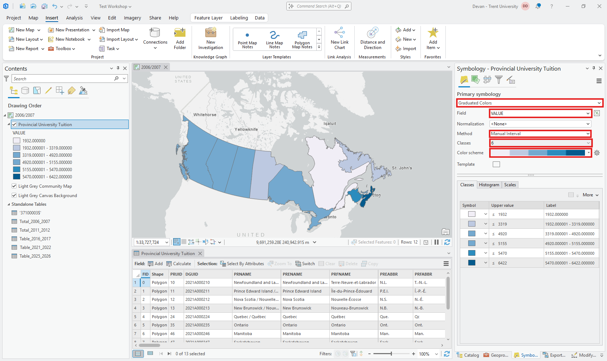
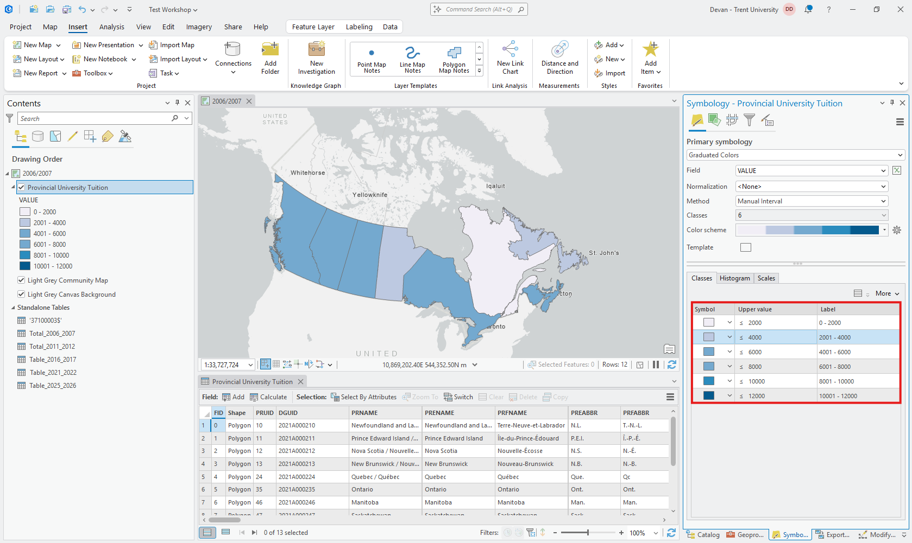
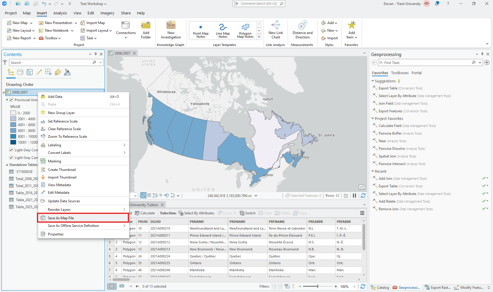

# Joining the Data

We will join by DGUID (Dissemination Geography Unique Identifier). This is how we link the census data to the geospatial data. *Right-click* Provincial University Tuition

This will open the Add Join pane. You will need to select the following options:
* *Input Field* select **DGUID**
* *Join Table* select **Total_2006_2007**
* *Join Field* select **DGUID**

Once you have changed those fields *click* **OK**

Repeat this process with the other four years to join each of them to the geospatial data. Make sure when you are selecting the *Input Field* you select **DUID [lpr_000b21a_e.DGUID]**.

Now that all of our data is joined we can start creating maps for each of our years of interest. *Click* the Map once to rename it to 2006/2007. Now *Right-click* Provincial University Tuition and select **Symbology**

This opens up the **Symbology** pane where we can change the primary symbology. *Click* the drop-down menu and select *Graduated Colours*. We will be changing the following fields:
* *Field* select **THE FIRST** ***Value*** (This is from the 2006/2007 Join)
* *Classes* select **6**
* *Method* select **Manual Interval**
* *Color Scheme* select one that you like

Since we are using manual breaks, let's make them nice even breaks. Starting at the bottom change the *Upper Value* to **12 000**. Decrease the value by 2000 each step down. Change the *Labels* to remove the excess 0's.

Awesome, that's our first map done! Now we just need to repeat this for the other 4 years. Let's save this map. *Right-click* the 2006/2007 map and select **Save As Map File**. In the *Save As Map File* pane, remove the slash between 2006 and 2007, then *click* **Save**.

