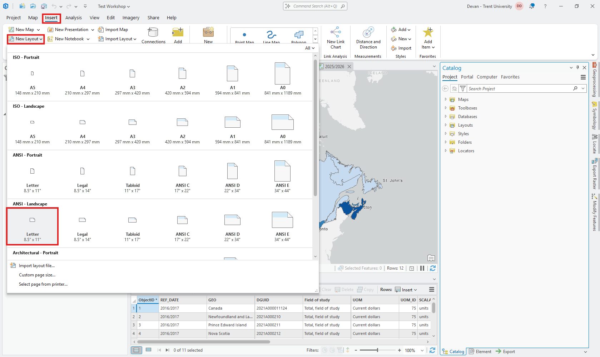
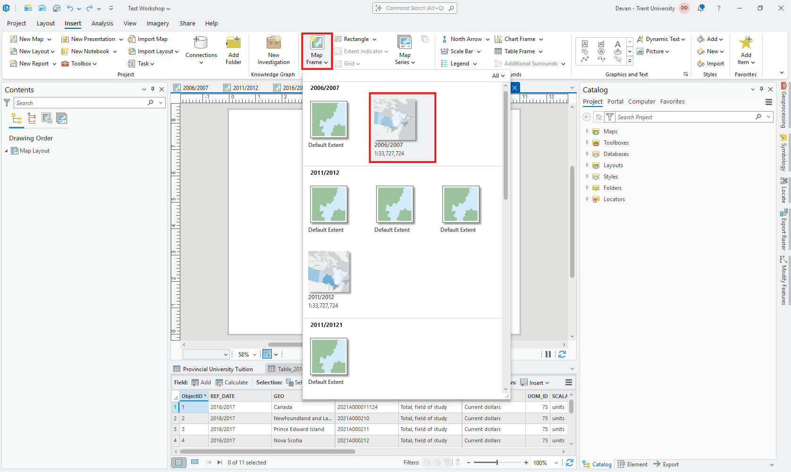
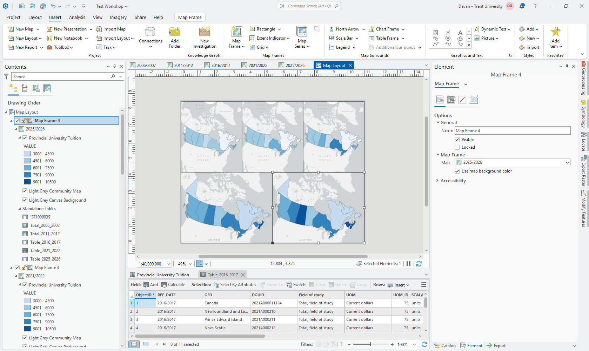

# Creating a Layout

Begin by switching to the *Insert* tab. Then *click* **New Layout**. You can pick any size you want, for this tutorial I selected *ANSI - Landscape Letter*. Rename it to something as thsi will be the defualt name when exporting.

# Adding Map Frames

To add out map frames, from the *Insert* tab, *click* **Map Frame**. This will open a drop down where you can select your map frames one by one. This will prompt you to draw a square for the area you want the frame to fill. Draw any size as we will manually adjust the size.

With the square drawn we can adjust the size, scale, and center. To make these adjustments *double-click* the map frame to open the *Element* pane. We will place 3 maps in the top half and the other two on the bottom half.

For the top three maps use the following:
* Size - **Placement Tab** Width: 3.6667in + Height: 3.25in
* Scale - **Display Options Tab** Scale: 1:60,000,000
* Center - **Display Options Tab** Center: 89.6192135°W + 58.3247811°N (Map Display (Decimal Degrees))

For the bottom two maps use the following:
* Size - **Placement Tab** Width: 5.5in + Height: 3.25in
* Scale - **Display Options Tab** Scale: 1:40,000,000
* Center - **Display Options Tab** Center: 89.7695937°W + 59.4117425°N (Map Display (Decimal Degrees))

Once you've add all these frames your layout should look like this: 

# Map Elements

