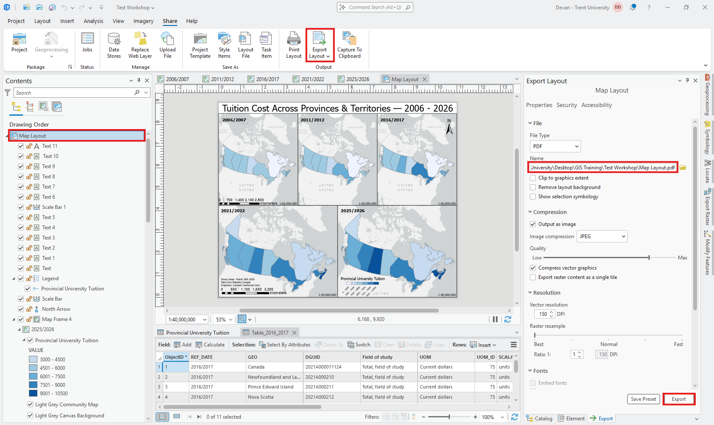

# Exporting your Layout

With your *Map Layout* selected, in the *Share* tab, *click* **Export Layout**. Change the name of your file and your output directory. Adjust any other settings as you desire. Once you are done select **Export**. Now you are able to share your map! 

